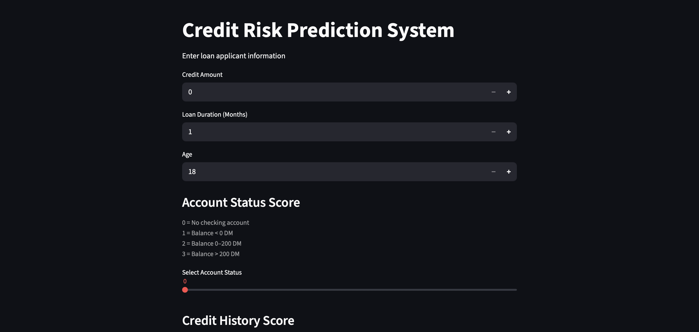
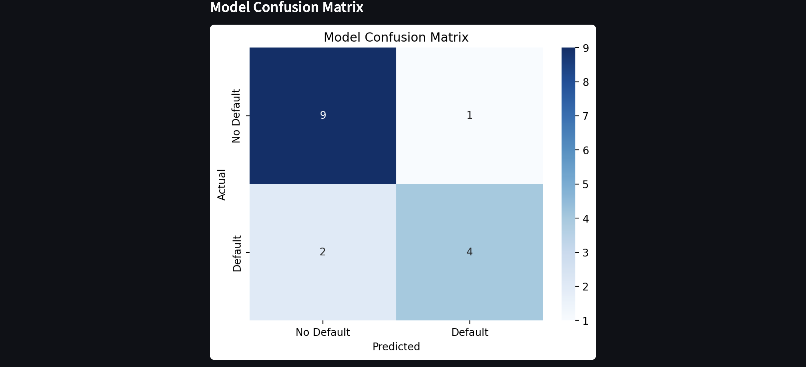
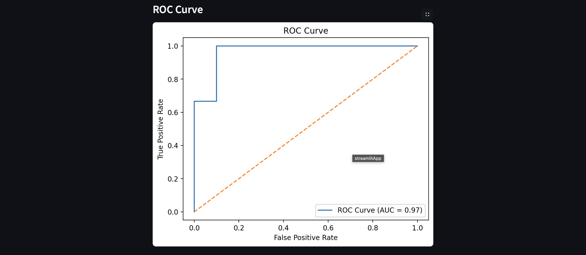
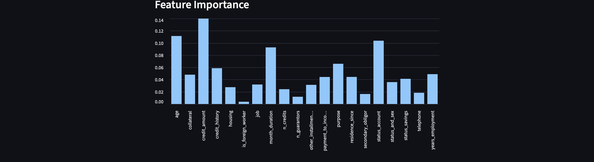

# Credit Risk Prediction System

A machine learning system that predicts the probability of loan default using the **German Credit Dataset**.

This project demonstrates how machine learning can help financial institutions evaluate **credit risk** and decide whether a loan applicant is likely to default.

---

## Live Application

https://credit-risk-model-ak.streamlit.app

---

## Features

* Logistic Regression and Random Forest models
* Default probability prediction
* Risk score (0–100)
* Loan approval decision
* Feature importance visualization
* Confusion matrix and ROC curve
* Interactive dashboard using Streamlit

---

## Application Interface

### Credit Risk Dashboard



The user enters loan applicant information such as:

* Credit Amount
* Loan Duration
* Age
* Account Status Score
* Credit History Score

The model then predicts whether the applicant is **Low Risk or High Risk**.

---

### Model Confusion Matrix



The confusion matrix evaluates the model’s performance by showing:

* True Positives
* True Negatives
* False Positives
* False Negatives

---

### ROC Curve



The ROC curve measures how well the model distinguishes between safe and risky borrowers.

The **AUC (Area Under Curve)** indicates the overall model performance.

---

### Feature Importance



Feature importance shows which financial variables most influence the credit risk prediction.

Important variables include:

* Credit amount
* Account status
* Loan duration
* Age
* Credit history

---

## Tech Stack

* Python
* Pandas
* NumPy
* Scikit-learn
* Streamlit
* Matplotlib
* Seaborn

---

## Dataset

German Credit Dataset

The dataset contains **21 financial attributes** describing borrower profiles such as:

* Credit amount
* Loan duration
* Account status
* Credit history
* Employment years
* Housing type
* Number of existing credits
* Age
* Job status

These variables help estimate the probability of **loan default**.

---

## How to Run

Clone the repository

```
git clone https://github.com/akmanis/credit-risk-model.git
cd credit-risk-model
```

Install dependencies

```
pip install -r requirements.txt
```

Run the application

```
streamlit run app/app.py
```

---

## Project Structure

```
credit-risk-model
│
├── app/                → Streamlit application
│   └── app.py
│
├── data/               → Dataset
│   └── german_credit_data.csv
│
├── images/             → Project screenshots
│   ├── dashboard.png
│   ├── confusion_matrix.png
│   ├── roc_curve.png
│   └── feature_importance.png
│
├── model/              → Model training script
│   └── train_model.py
│
├── credit_model.pkl    → Trained machine learning model
├── requirements.txt
└── README.md
```

---

## Model Performance

| Model               | Accuracy |
| ------------------- | -------- |
| Logistic Regression | 74%      |
| Random Forest       | 82%      |

Random Forest was selected as the final model due to higher predictive accuracy.

---

## Author

Manish AK
BS Economic Sciences
Indian Institute of Science Education and Research (IISER) Bhopal

Interested in:

* Fintech
* Machine Learning
* Credit Risk Modeling
* Financial Data Science
